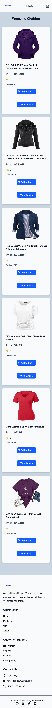
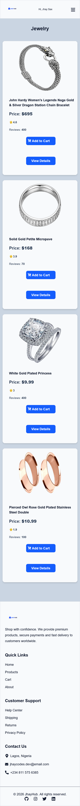
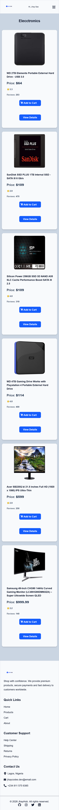
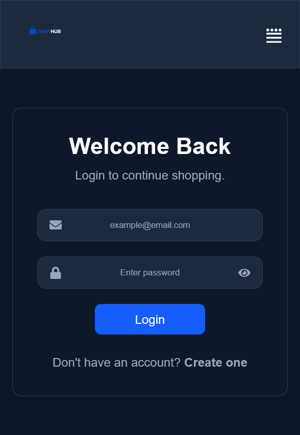
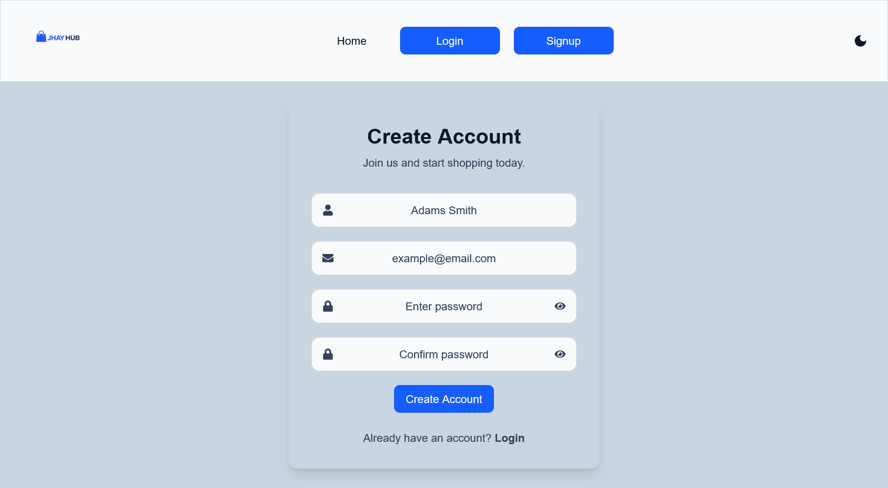
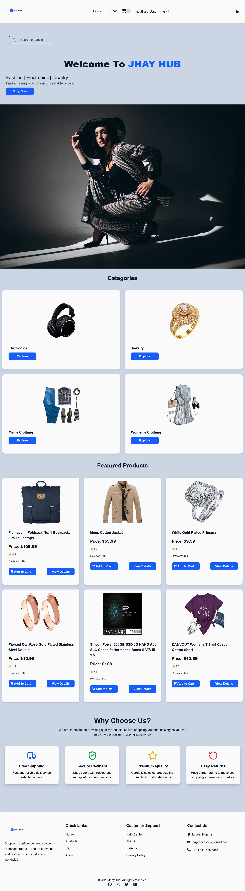

# 🛍️ JHAY HUB – React E-commerce Application

A modern, responsive e-commerce web application built with **React**, **Vite**, and **Tailwind CSS**. The project consumes data from the **Fake Store API** to provide a realistic online shopping experience while demonstrating modern React development practices.

This project was built to strengthen my understanding of React fundamentals, reusable component architecture, state management, routing, API integration, responsive design, and frontend best practices.

---

## ✨ Features

* 🛒 Browse all available products
* 🔍 Search for products
* 📂 Browse products by category
* 📱 Fully responsive design
* 🌙 Dark & Light mode
* 🛍️ Shopping cart functionality
* 📄 Product details page
* 🔐 Login and Sign Up forms
* ⚡ Loading state while fetching data
* 🚫 Custom 404 (Not Found) page
* 🎨 Custom category images
* 🖼️ Custom favicon
* 🔎 Basic SEO optimization
* 🎯 Reusable React components
* 🎨 Custom CSS utilities in `index.css`

---

## 📁 Project Structure

```text
src
│
├── components
│   ├── About
│   ├── Button
│   ├── CategoryCard
│   ├── Footer
│   ├── Hero
│   ├── Input
│   ├── Loading
│   ├── Login
│   ├── NavBar
│   ├── ProductCard
│   ├── SearchBar
│   └── SignUp
│
├── context
│   ├── AuthContext
│   ├── CartContext
│   └── ThemeContext
│
├── pages
│   ├── Cart
│   ├── Electronics
│   ├── FeaturedProduct
│   ├── Home
│   ├── Jewelry
│   ├── Mens
│   ├── NotFound
│   ├── ProductDetails
│   ├── Shop
│   ├── WhyChooseUs
│   └── Women
```

---

## 🚀 Technologies Used

* React
* Vite
* JavaScript (ES6+)
* Tailwind CSS
* React Router
* React Icons
* React Hook Form
* Context API
* Fake Store API
* Prettier

---

## 📸 Screenshots

### 🏠 Home Page


---

### 🛍️ Shop Page


---

### 👕 Men's Collection


---

### 👗 Women's Collection



---

### 💍 Jewelry Collection



---

### 💻 Electronics Collection



---

### 📄 Product Details


---

### 🛒 Shopping Cart


---

### 🔐 Login Page



---

### 📝 Sign Up Page



---

### 🌙 Dark Mode


---

### ☀️ Light Mode



---

### 🚫 404 Page


## ⚙️ Installation

Clone the repository:

```bash
git clone <repository-url>
```

Navigate into the project:

```bash
cd E_COMMERCE-REACT-APP
```

Install dependencies:

```bash
npm install
```

Start the development server:

```bash
npm run dev
```

---

## 📦 API

This project uses the **Fake Store API** for product data.

API Endpoint:

```
https://fakestoreapi.com/products
```

---

## 🎯 What I Learned

Building this project strengthened my understanding of:

* React component architecture
* State management with Context API
* React Hooks (`useState`, `useEffect`, `useContext`)
* React Router navigation
* Fetching and displaying API data
* Conditional rendering
* Reusable components
* Responsive UI design
* Search and filtering logic
* Dark and Light theme implementation
* Organizing scalable React applications

---

## 🔮 Future Improvements

Planned enhancements include:

* Offline fallback using local JSON data whenever the Fake Store API is unavailable.
* Persist fetched products in Local Storage to reduce unnecessary API requests and improve reliability.
* Product sorting (price, popularity, newest).
* Wishlist functionality.
* User authentication with a backend service.
* Checkout and payment integration.
* Product reviews and ratings.
* Pagination and lazy loading.
* Performance optimization.
* Unit and integration testing.

---

## 👨‍💻 Developer

Developed by **JhayCodes**

This project is part of my journey toward becoming a skilled software developer while building production-style React applications that emphasize clean architecture, maintainable code, and a great user experience.

GitHub - [@JhayCodesDev](https://github.com/JhayCodesDev)

Twitter - [@JhayCode](https://www.twitter.com/JhayCodes)

Instagram - [@jhaycodes\_](https://www.instagram.com/jhaycodes_?igsh=MW45Nzg3anVjbjV0ZQ==)

LinkedIn - [Joshua Odusanya](https://www.linkedin.com/in/joshua-odusanya-9b67aa292/)

---

## 📄 License

This project is licensed under the MIT License.
